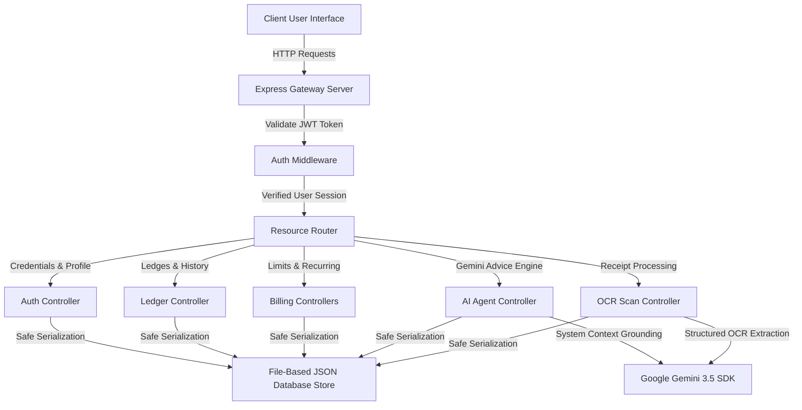

# 📊 Smart Expense Tracker Web Application


Welcome to the **Smart Expense Tracker Web Application**, a modern, production-ready, full-stack personal finance and AI-powered wealth management engine. Built with a highly modular architecture using **React & TypeScript** with **Tailwind CSS** on the frontend, and a performant **Express & Node.js** core on the backend, this platform empowers users to monitor their wealth, automate recurring bills, execute real-time multi-currency conversions, and access dynamic financial insights powered by Google's state-of-the-art **Gemini 3.5 Models**.

---

## 🏗️ System Architecture & Data Flow

Our system leverages a robust modular pattern separating frontend controls from backend API routes, enabling secure, credential-safe integration with Gemini services.


Below is the transactional and intelligence data flow lifecycle:



---

## 📁 Repository Directory Structure

This workspace features a decoupled architectural pattern, allowing the same codebase to run in a highly fast full-stack development environment or compile into standalone distribution sets.

```
Smart-Expense-Tracker-Web-App/ (Repository Root)
│
├── server.ts                   # Core Full-Stack Gateway entry point (Express + Vite)
├── package.json                # Master deployment configuration and commands
├── tsconfig.json               # Shared compiler rules for TypeScript
├── vite.config.ts              # Vite asset bundle pipeline config
├── index.html                  # Master Single Page Application container
├── .env.example                # Blueprint for local API keys configuration
│
├── src/                        # Frontend React client application workspace
│   ├── main.tsx                # Client mounting point and global style imports
│   ├── App.tsx                 # Master view router, session states and logic
│   ├── types.ts                # Strict visual models and schema declarations
│   └── index.css               # Global styling directives customized with Tailwind CSS
│
├── server/                     # Decoupled server endpoints and backend models
│   ├── config/                 # Initial configurations and file-based DB engines (db.ts)
│   ├── middleware/             # Encrypted session verifiers (auth.ts)
│   ├── routes/                 # Express modular REST endpoints (api.ts)
│   ├── controllers/            # Controller processing functions (authController & expenseController)
│   └── models/                 # MERN-style data model blueprints (Schemas.ts)
│
└── Smart-Expense-Tracker-Web-App/ # Course Project workspace and documentation
    └── docs/                   # Architectural visual logs
        └── images/             # Visual images and UI screenshots
```

---

## 📸 Application Live Interfaces

Explore the high-fidelity user interfaces constructed specifically for the Smart Expense Tracker:

### 🟢 Dashboard & Real-Time Financial Trends
The transactional control center features clean bento-grid modules, instant KPI summary cards (for Inflow, Outflow, Net Surplus, and active overall Budget limits), and responsive data charts plotting cashflow velocity trends and category proportions.


### 🤖 Gemini CFP® Wealth Coach & Receipt OCR Scanner
Engage in a live connection with our Google Gemini financial consultant or instantly scan standard receipt statements using artificial intelligence to parse and ingest transactions with zero manual typing required.


---

## ⚡ Key Capabilities and Features

| Category | Capability | Technical Details |
| :--- | :--- | :--- |
| 🛡️ **Security** | JSON Web Token (JWT) Protocol | 256-bit signed session identifiers with standard 7-day expiration routines. |
| 📈 **Visuals** | Recharts Financial Modules | Interactive line charts reflecting trend vectors, category distribution graphs, and real-time budget burn indices. |
| 💱 **Currency** | Multi-Currency Auto-Conversion | Normalizes transactions logged in USD, EUR, INR, GBP, JPY, CAD, and AUD back to the user's localized base currency instantly. |
| 🤖 **A.I.** | Google Gemini CFP Planner | Performs multi-parameter analytics across all logged items to discover financial leakage categories. |
| 🔍 **Utility** | Fast OCR Text Scans | Extracts vendor name, date, itemized list, prices, and taxes from receipts, compiling them straight into transactions. |
| 📋 **Bulk Ingest** | Statement Copy-Paste Parser | Supports direct copy-pasting of raw bank statement columns, performing automatic data formatting. |

---

## 🚀 Setting Up Your Environment (Local Deployment)

Follow these directions to deploy the application in under 3 minutes.

### 📋 Prerequisites
- **Node.js** v18.0.0 or higher
- **npm** v9.0.0 or higher
- A Google Gemini API Key (optional; falls back safely to simulation mocks)

### 🔑 1. Setup Environment Variables
Create a `.env` file inside the workspace root (and document parameters in `.env.example` as required):

```env
# Server Port Configuration
PORT=3000

# Security Signatures
JWT_SECRET=your_custom_secure_server_signature_key

# Google Gemini API Credentials
GEMINI_API_KEY=your_live_google_gemini_api_key_here
```

### 🛠️ 2. Clean Installation and Running
Since this setup features customized developer execution paths, launching is incredibly straightforward.

#### Install all top-level dependencies:
```bash
npm install
```

#### Run Project in Development Mode:
```bash
npm run dev
```

The system will start, launching the client-side asset reloader and binding the Express server API safely to port **3000**. Open your browser of choice and visit `http://localhost:3000` to interact with the system.

---

### 🎨 Visual Theme Specification

The platform leverages a custom-developed **Cosmic Slate Theme** constructed with the following color variables:
- **Canvas Base Background**: `bg-slate-950`
- **Component Elevated Panels**: `bg-slate-900 border-slate-800`
- **Core Vector Accents**: `emerald-500` (Inflow), `rose-500` (Outflow), `blue-600` (Interactive Buttons), `amber-500` (Budget limits warnings).
- **Typography pairings**: Main interface headers paired with **Space Grotesk** and **Inter** for beautiful text spacing, matched with **JetBrains Mono** for numbers, currencies, and timestamps.

---

*This Smart Expense Tracker codebase represents high-fidelity coding patterns, meticulous modularity, and optimized full-stack standard procedures ready to act as a gold standard in modern financial tooling.*
