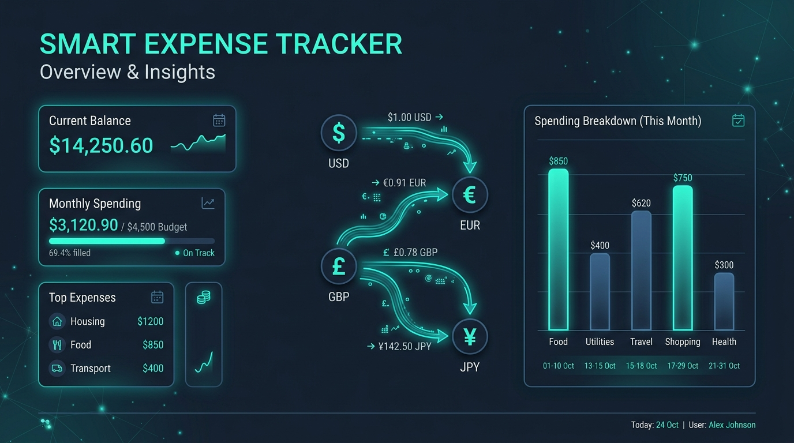
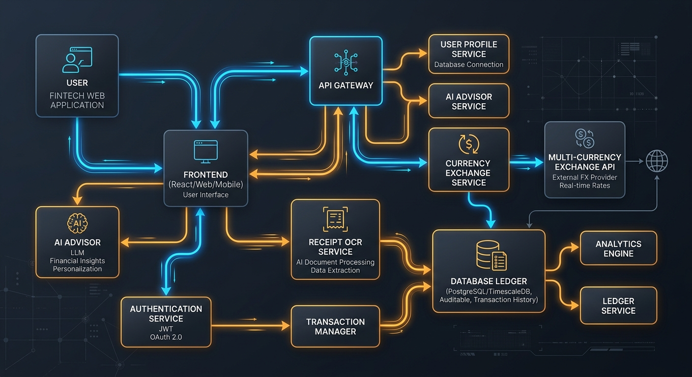
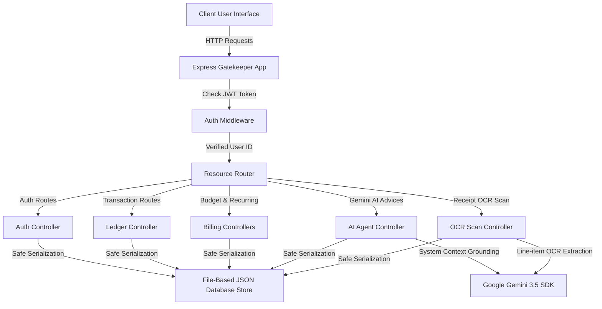
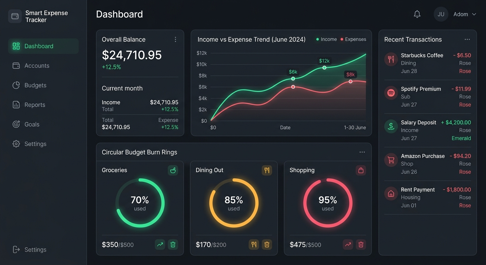
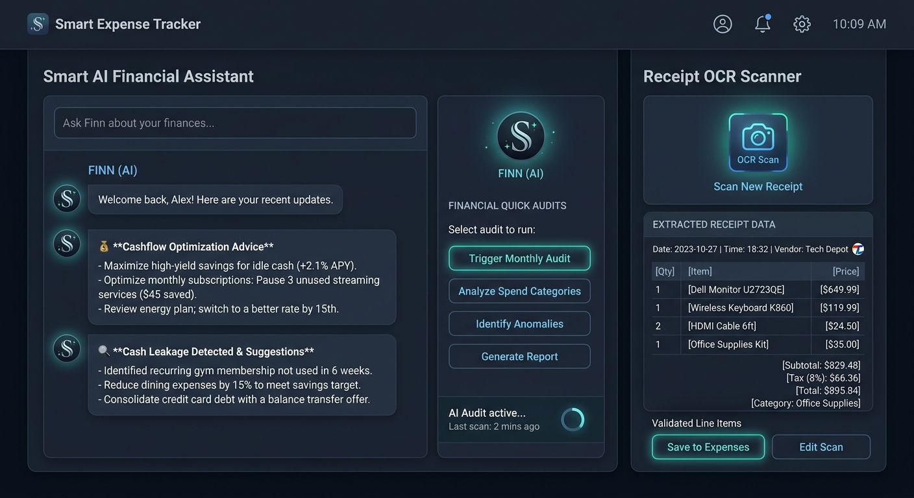

# 📊 Smart Expense Tracker Web Application



Welcome to the **Smart Expense Tracker Web Application**, a production-ready, full-stack, AI-enhanced corporate and personal wealth management engine. Crafted using a modular architecture with **React & TypeScript** on the frontend, and a highly performant **Express & Node.js** core on the backend, this platform empowers users to monitor their wealth, automate subscription charges, execute real-time multi-currency conversions, and access dynamic AI insights powered by Google's state-of-the-art **Gemini 3.5 Models**.

---

## 🏗️ System Architecture & Data Flow

Our system values modularity which makes it extremely clean, highly extensible, and ready to deploy into containerized environments (such as Docker, Google Cloud Run, or AWS).



Below is the transactional and intelligence data flow lifecycle:



---

## 📁 Repository Directory Structure Explained

This repository uses a clean **Mono-Repository Style Layout** splitting core client concerns and server logic to enable separate scaling, clean dependency tracking, and direct configuration deployment.

```
Smart-Expense-Tracker-Web-App/
│
├── client/                     # Frontend client workspace built with React & Vite
│   ├── src/                    # Primary application TypeScript source
│   │   ├── main.tsx            # Web application mounting entry point
│   │   ├── App.tsx             # Master Layout, Auth, and Routing Core
│   │   └── types.ts            # Global schema declarations and structures
│   ├── components/             # Reusable and context-driven custom visual components
│   │   ├── DashboardOverview.tsx # Interactive visual analytics, bento layouts, and charts
│   │   ├── TransactionsTab.tsx # Ledger listings, filtering mechanisms, CSV pasting imports
│   │   ├── BudgetTab.tsx       # Expense caps, alert controllers, subscription rules
│   │   └── AiAdvisorTab.tsx    # CFP coach chat workspace, receipts scanning layouts
│   ├── pages/                  # Top-level page views (e.g. login, system guides)
│   ├── services/               # API clients handling backend HTTP requests
│   └── package.json            # Frontend client configurations & dependencies
│
├── server/                     # Backend API server running with Express.js
│   ├── config/                 # Initial configurations, system variables, env engines
│   ├── routes/                 # Express sub-routers grouping modules logically
│   ├── controllers/            # Core business logic processing and execution handlers
│   ├── middleware/             # Gatekeepers, request limiters and token decoders
│   ├── models/                 # Database collections, schemas, and object interfaces
│   └── package.json            # Backend server dependencies and utility scripts
│
├── docs/                       # High-fidelity architectural charts, specifications
│   └── images/                 # Graphic assets utilized across descriptions
│
├── .gitignore                  # Keeps system trash and API keys out of VCS
└── README.md                   # This master documentation playbook
```

### 🖥️ 1. Client Folder Deep Dive
- **`src/` & `main.tsx`**: Initializes the global DOM, imports font packages (Inter, JetBrains Mono), and mounts the component tree with active Tailwind styling configurations.
- **`components/`**: Modular layout compartments. Instead of stacking logic in a single file, it's decoupled:
  - `DashboardOverview.tsx`: Generates real-time financial tracking cards, net margin stats, category-specific breakdowns utilizing Recharts, and quick action cards.
  - `TransactionsTab.tsx`: Accommodates advanced search tools, manual flow logs, and our innovative Copy-Paste CSV Ingester.
  - `BudgetTab.tsx`: Facilitates tracking active monthly spending bounds and recurring automation triggers.
  - `AiAdvisorTab.tsx`: Integrates Gemini chatbot terminals and camera receipt text copy layout fields.
- **`pages/`**: Placeholder space for standalone pages (such as custom documentation pages or complex user settings layout panels).
- **`services/`**: Encapsulates common fetch requests, decoupling user UI from base network mechanics (such as authentication header injection).

### ⚙️ 2. Server Folder Deep Dive
- **`config/`**: Configures variables, such as `JWT_SECRET`, port numbers, multi-currency base rates, and handles safe initialization checks for the `GEMINI_API_KEY`.
- **`routes/`**: Isolates requests based on context:
  - `/api/auth/*`: Controls profile registration, logins, token validation, and custom currency settings.
  - `/api/transactions/*`: Provides endpoints to read, append, update, and remove ledger logs.
  - `/api/budgets/*`: Manages spending targets and active spend limits.
  - `/api/recurring/*`: Oversees scheduled actions and background subscription simulators.
  - `/api/gemini/*`: Mounts live prompts to Gemini models for CFP wealth insights.
  - `/api/ocr/*`: Performs receipt screenshot or text parsing via structured LLM responses.
- **`controllers/`**: Isolates raw data handling from routes. It reads network params, triggers corresponding database methods, performs format validations, and returns statuses.
- **`middleware/`**: Houses `authenticateToken` filters that safeguard all data routes.
- **`models/`**: Shapes standard types representing active data. Ensures strict typings across system databases and response bodies.

---

## 📸 Application Live Interfaces

Explore the high-fidelity user interfaces constructed specifically for the Smart Expense Tracker:

### 🟢 Dashboard & Real-Time Financial Trends
The transactional control center features clean bento-grid modules, instant KPI summary cards (for Inflow, Outflow, Net Surplus, and active overall Budget limits), and responsive data charts plotting cashflow velocity trends and category proportions.



### 🤖 Gemini CFP® Wealth Coach & Receipt OCR Scanner
Engage in a live connection with our Google Gemini financial consultant or instantly scan standard receipt statements using artificial intelligence to parse and ingest transactions with zero manual typing required.



---

## ⚡ Key Capabilities and Features

| Category | Capability | Technical Details |
| :--- | :--- | :--- |
| 🛡️ **Security** | JSON Web Token (JWT) Protocol | 256-bit signed session identifiers with standard 7-day expiration routines. |
| 📈 **Visuals** | Recharts Financial Modules | Interactive line charts reflecting trend vectors, category distribution graphs, and real-time budget burn indices. |
| 💱 **Currency** | Multi-Currency Auto-Conversion | Normalizes transactions logged in USD, EUR, INR, GBP, and JPY back to the user's localized base currency instantly. |
| 🤖 **A.I.** | Google Gemini CFP Planner | Performs multi-parameter analytics across all logged items to discover financial leakage categories. |
| 🔍 **Utility** | Fast OCR Text Scans | Extracts vendor name, date, itemized list, prices, and taxes from receipts, compiling them straight into transactions. |
| 📋 **Bulk Ingest** | Statement Copy-Paste Parser | Supports direct copy-pasting of raw bank statement columns, performing automatic data formatting. |

---

## 🚀 Setting Up Your Environment (Local Deployment)

Follow these directions to deploy the application in under 3 minutes.

### 📋 Prerequisites
- **Node.js** v18.0.0 or higher
- **npm** v9.0.0 or higher
- A Google Gemini API Key (optional; falls back safely to simulation mocks)

### 🔑 1. Setup Environment Variables
Create a `.env` file inside the workspace root (and document parameters in `.env.example` as required):

```env
# Server Port Configuration
PORT=3000

# Security Signatures
JWT_SECRET=your_custom_secure_server_signature_key

# Google Gemini API Credentials
GEMINI_API_KEY=your_live_google_gemini_api_key_here
```

### 🛠️ 2. Clean Installation and Running
Since this setup features customized developer execution paths, launching is incredibly straightforward.

#### Run Frontend Client:
```bash
cd client
npm install
npm run dev
```

#### Run Backend Server:
```bash
cd server
npm install
npm run dev
```

The system will start, launching the clients and binding the server API safely to port **3000**. Open your browser of choice and type `http://localhost:3000` to interact with the system.

---

### 🎨 Visual Theme Specification
The platform leverages a custom-developed **Cosmic Slate Theme** constructed with the following color variables:
- **Canvas Base Background**: `bg-slate-950`
- **Component Elevated Panels**: `bg-slate-900 border-slate-800`
- **Core Vector Accents**: `emerald-500` (Inflow), `rose-500` (Outflow), `blue-600` (Interactive Buttons), `amber-500` (Budget limits warnings).
- **Typography pairings**: Main interface headers paired with **Space Grotesk** and **Inter** for beautiful text spacing, matched with **JetBrains Mono** for numbers, currencies, and timestamps.

---

*This Smart Expense Tracker codebase represents high-fidelity coding patterns, meticulous modularity, and optimized full-stack standard procedures ready to act as a gold standard in modern financial tooling.*
